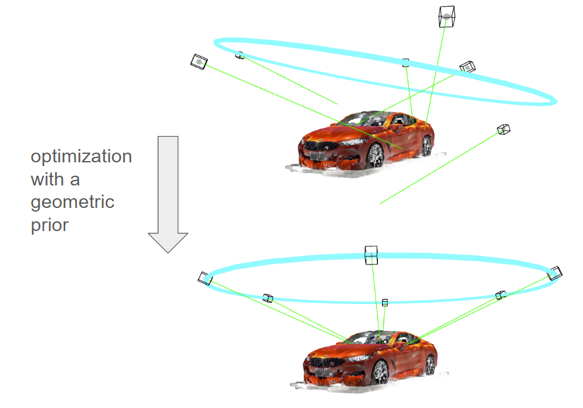

# Geometric Priors in Ceres

<p align="center">
  
</p>

## Overview
This repository contains a bundle adjuster capable of optimizing camera poses using quaternion (quat), angle axis, or ring parameter representations. [A writeup for this project is here](https://jp-mess.github.io/relative-geometry-article/). I've put some basic directions on how to navigate this repo here, but I assume it's too all-over-the-place for anyone to actually use it. The repo is divided into some python scripts for setting up 3D simulations (see main.py), and a C++ bundle adjuster routine that is a heavily modified version of the [ceres examples](https://github.com/ceres-solver/ceres-solver/tree/master/examples)

## Getting Started

### For C++ stuff (running the bundle adjuster)
- [Ceres Solver](http://ceres-solver.org/installation.html)
- [Eigen](http://eigen.tuxfamily.org/index.php?title=Main_Page)
- C++ Compiler and Build Tools

### For python libraries (setting up a simulation)

```bash
python3 -m venv venv
source venv/bin/activate  # I assume you're using Linux

pip install -r requirements.txt
```

### Running the Bundle Adjuster

#### Ring Parameters
- Ensure your input files include ring parameters.
- Run:
  ```bash
  ./bundle_adjuster --mode ring --input <BAL_file> --ring <ring_params_file>
  ```

ring parameters format:

```bash
type: ring
center: -9.62,1.6997988337585919,-1.345
normal: 0,1,0
radius: 4.435545574436417
elevation_degree: 62.512197716891464
```


#### Quaternion Representation
- Run:
  ```bash
  ./bundle_adjuster --mode quat --input <BAL_file>
  ```

#### Angle Axis Representation
- Run:
  ```bash
  ./bundle_adjuster --mode angle --input <BAL_file>
  ```


