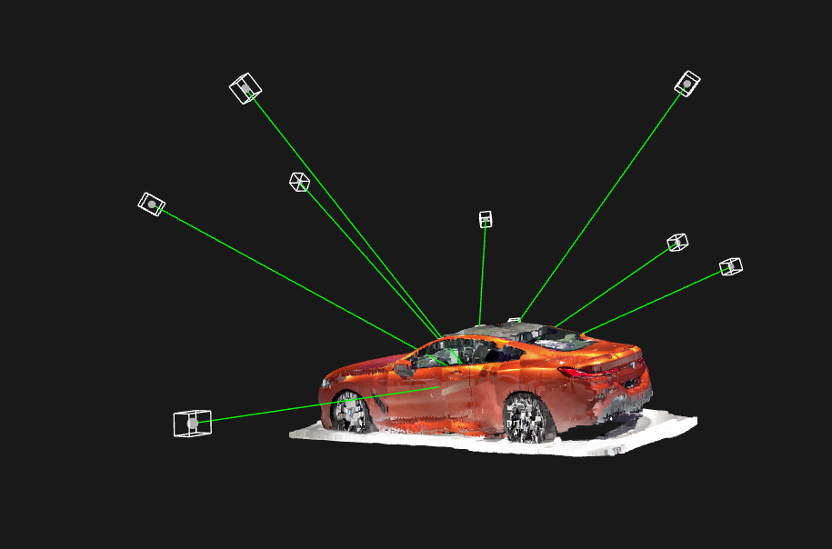
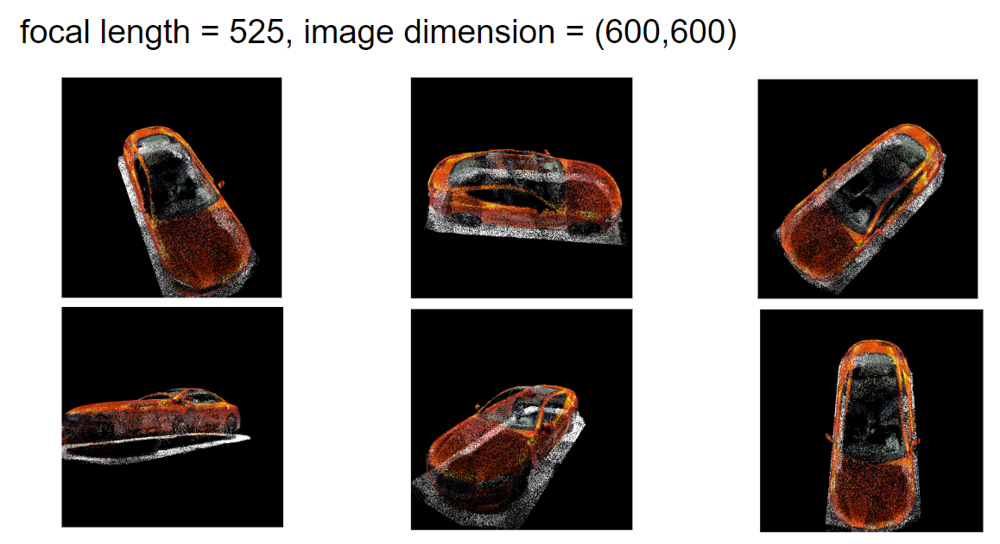

# 3D Computer Vision Simulation Environment

<p align="center">
  
</p>


## Introduction

This repository provides a simulation environment for 3D computer vision alignment problems, specifically focusing on bundle adjustment. It serves as a straightforward setup for those interested in delving into computer vision algorithms without the complexity of building an experimental setup from the ground up. The environment includes functionality for noise modeling in camera views and an implementation of bundle adjustment using Ceres in C++, along with an encoding scheme to facilitate data exchange between Python scripts and the C++ optimization framework.

## Features

- **Camera View Sampling**: Tools for sampling camera views around a point cloud (`.ply` format).
- **Image Rendering**: Functionality to render point cloud views into images.
- **Point Cloud Retriangulation**: Capability for both pairwise and multiview DLT triangulation schemes.
- **Bundle Adjustment**: Simple Levenberg-Marquardt bundle adjustment is implemented and tested (with an easy encoding scheme for going back and forth between the python scripts, without using pybind11).

## Python Requirements

The Python dependencies for this project are listed in `requirements.txt`. To install these dependencies, run the following command in your Python environment:

```bash
pip install -r requirements.txt
```

## Using the Python Simulation Environment

<p align="center">
  
</p>

### Overview

The Python component of the simulator, primarily encapsulated within `experiments.py`, comprises various functions for setting up and conducting 3D computer vision experiments. These functions facilitate the creation of tailored camera models with specific extrinsic and intrinsic parameters, designed to work with individual point clouds.

### Key Requirements

- **Y-Axis Up-Direction**: It's essential for all point clouds used in experiments to have a 'y-axis' up-direction. This orientation is crucial for ensuring the accuracy of camera models and subsequent processes.
- **Experiment Functions**: The functions in `experiments.py` each represent a unique experimental setup, specifically crafted for different point clouds. Designed to be intuitive, these functions guide users through the setup process.

### Running Experiments

To run an experiment, you will need to choose an appropriate function from `experiments.py`. The main function in the simulator will execute your selected experiment. For experiments involving bundle adjustment, the problem's encoding will be directed to the `problem_encodings` directory. A compressed point cloud of a BMW is provided in the `source-point-clouds` directory for convenience. You can also explore a variety of free point clouds available on [Sketchfab](https://sketchfab.com) for some larger and more interesting 3D models.

Please note that to run the simulator, you need to update the point cloud file path in `main.py`, as it is not set in `experiments.py`. Currently, everything inside `main.py` is hard-coded, and you run the main program with `python main.py`. Apologies for any inconvenience—this project was developed for personal use and convenience, and is not meant to be a rigorous, feature-complete framework.

